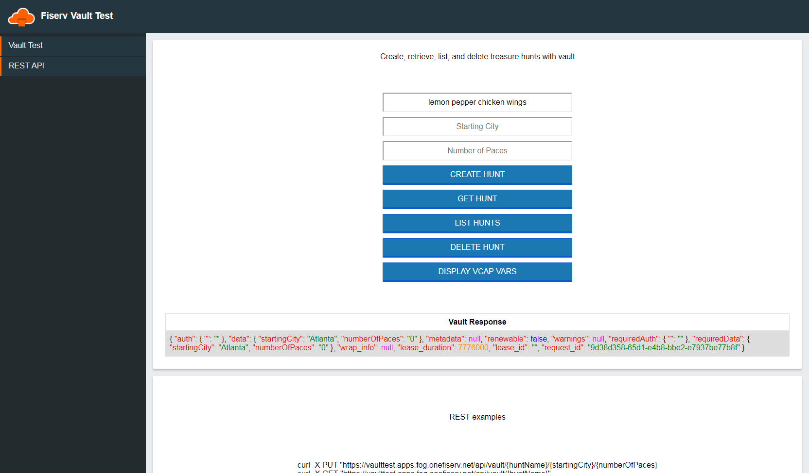

## Vault Test
Cloud native applicaiton intended be used in testesting vault service brokers.
App needs to bind to a service instance, then can read interact with vault.
Only tested on the bosh-beta.
You are going to be storing treasure hunts in vault.
I opted not to use the word treasure map because a map is a java interface.
The keystore might have your key? might not.

- Feature to create a treasure hunt.
- Feature to get a treasure hunt.
- Feature to list all treasure hunts.
- Feature to delete a treasure hunt.
- Feature to show used VCAP variables (DISPLAYS YOUR VAULT TOKEN TO ANYONE!).

## To implement:
1. Clone repo
1. validate your certificate is in the cert store
1. mvn package
1. Run cf push --no-start
1. Bind vault service instance
1. cf start

